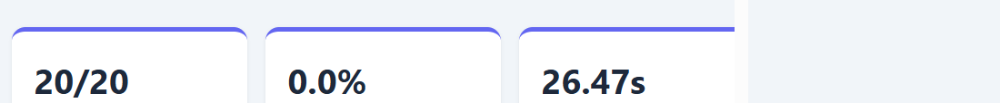
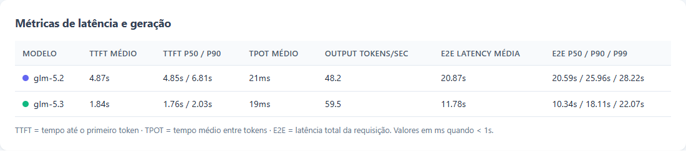
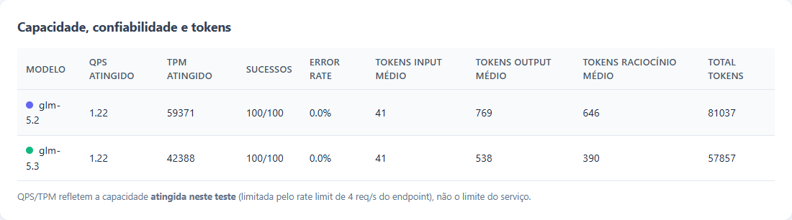
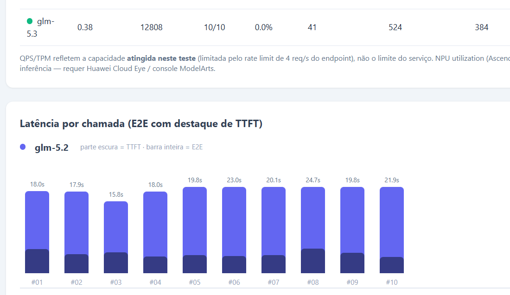
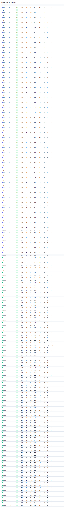

# Teste de requisições a modelos Huawei MaaS

Script em Python para executar requisições concorrentes à API de chat OpenAI-compatible do Huawei MaaS.

As chamadas usam streaming e geram um resumo no terminal e um relatório HTML com métricas de latência, throughput, tokens e confiabilidade.

## Requisitos

- Python 3.8 ou superior.
- Acesso à API Huawei MaaS e uma chave válida para os modelos configurados.
- Dependência `requests`.

Instale a dependência:

```bash
python3 -m pip install requests
```

Configure a chave da API no ambiente. Não a coloque no código nem a compartilhe:

```bash
export MAAS_API_KEY="sua-chave-aqui"
```

## Executar o teste

Na pasta do projeto, execute:

```bash
python3 maas_parallel_test.py
```

Por padrão, o script envia 100 chamadas para cada modelo em `MODELS` (`glm-5.2` e `glm-5.3`), totalizando 200 chamadas e até 200 workers (`MAX_WORKERS = len(MODELS) * CALLS_PER_MODEL`).

Um limitador compartilhado mantém o envio em até 4 requisições por segundo. Respostas HTTP 429 são repetidas com espera exponencial, até o máximo configurado.

As chamadas dos modelos concorrem no mesmo teste, portanto os resultados refletem essa carga compartilhada.

Para adaptar o teste, altere no início de `maas_parallel_test.py`:

- `MODELS`: nomes dos modelos disponíveis para sua conta/região.
- `CALLS_PER_MODEL`: quantidade de chamadas por modelo.
- `RATE_LIMIT_RPS`: limite de envio por segundo; ajuste de acordo com a quota autorizada do endpoint.
- `MAX_RETRIES` e `TIMEOUT`: política de repetição e tempo limite.
- `PROMPT`: solicitação enviada ao modelo. Para medir geração, use um prompt que produza uma resposta com quantidade razoável de tokens.

O limitador local ajuda a respeitar uma taxa de envio, mas não garante ausência de 429. Quotas podem ser compartilhadas, variar por modelo ou ter janelas diferentes. Não aumente a taxa sem confirmar os limites da sua conta.

## Resultado no terminal

Durante a execução, cada chamada concluída imprime modelo, identificador, status HTTP, latência E2E, TTFT e, quando houver, tentativas repetidas.

Ao final, há um resumo por modelo. A saída abaixo foi obtida em uma execução real com 100 chamadas por modelo:

```text
Executando 200 chamadas em paralelo (100 por modelo, modelos: glm-5.2, glm-5.3)...

[glm-5.3] chamada 03 | OK | HTTP 200 | E2E: 15.30s | TTFT: 1658ms | resposta: A inteligência artificial (IA) é um campo da ciência...
...

RESUMO

Modelo: glm-5.2
  Sucessos:        100/100 (error rate: 0.0%)
  Retries totais:  18
  TTFT médio:      4871ms (P50: 4846ms, P90: 6811ms)
  TPOT médio:      21ms
  Output tok/s:    48.2
  E2E média:       20.87s (P50: 20.59s, P90: 25.96s, P99: 28.22s)
  QPS atingido:    1.22 | TPM atingido: 59371
  Tokens médios:   in 41 / out 769 (raciocínio: 646)

Modelo: glm-5.3
  Sucessos:        100/100 (error rate: 0.0%)
  Retries totais:  14
  TTFT médio:      1841ms (P50: 1758ms, P90: 2032ms)
  TPOT médio:      19ms
  Output tok/s:    59.5
  E2E média:       11.78s (P50: 10.34s, P90: 18.11s, P99: 22.07s)
  QPS atingido:    1.22 | TPM atingido: 42388
  Tokens médios:   in 41 / out 538 (raciocínio: 390)

Tempo total de execução (todas em paralelo): 81.90s
Relatório HTML gerado em: .../maas_report.html
```

Esses valores são de uma execução específica e servem apenas para ilustrar o formato.

Latência, quantidade de tokens, retries e throughput variam com o prompt, carga, quota, região e estado do serviço.

## Relatório HTML

Ao terminar, o script grava `maas_report.html` na mesma pasta do arquivo Python. Abra-o em um navegador.

O relatório apresenta cards de resumo, tabelas de métricas, gráfico de latência por chamada e detalhes individuais.

As capturas abaixo correspondem à execução com 100 chamadas por modelo.

Cada nova execução substitui o relatório para acompanhar os novos resultados.

### Resumo da execução



### Latência e geração



### Capacidade, confiabilidade e tokens



### Latência por chamada



### Detalhes das chamadas



## Como interpretar as métricas

| Métrica | Significado neste teste |
|---|---|
| **TTFT** | Tempo entre o envio da requisição e o primeiro fragmento de token recebido. Para modelos de raciocínio, inclui o primeiro `reasoning_content` ou `content`, o que ocorrer primeiro. |
| **TPOT** | Estimativa do tempo médio por token de saída, calculada a partir da duração após o TTFT e da contagem de tokens de completion informada pelo serviço. |
| **Output tokens/sec** | Tokens de completion divididos pelo tempo de geração após o TTFT. Inclui tokens de raciocínio quando estes fazem parte de `completion_tokens`. |
| **E2E Latency** | Tempo total medido para a requisição, do envio ao fim do stream. O tempo na fila do limitador local fica fora desta medição. |
| **P50/P90/P99** | Percentis da latência E2E das chamadas bem-sucedidas. P90, por exemplo, indica o valor abaixo do qual ficaram 90% das chamadas observadas. |
| **QPS atingido** | Chamadas bem-sucedidas por segundo, calculadas usando o tempo total do teste. É throughput observado, não a quota máxima do serviço. |
| **TPM atingido** | Tokens de entrada e completion por minuto durante o teste. Também é throughput observado. |
| **Error rate** | Percentual de chamadas que terminaram sem sucesso, após as tentativas configuradas. |
| **Tokens/request** | Contagens de entrada, saída e raciocínio reportadas pela API, quando disponíveis. Tokens de raciocínio são uma parte dos tokens de saída; não devem ser somados novamente ao total. |

O relatório mostra a média de QPS/TPM por modelo usando a duração total da execução compartilhada.

Como os modelos são testados simultaneamente, esses valores não representam uma medição isolada nem o limite máximo de cada modelo.

## Como usar

1. Obtenha acesso ao Huawei MaaS e confirme que sua conta pode invocar os modelos desejados.
2. Disponibilize Python 3.8+ e instale `requests`.
3. Defina `MAAS_API_KEY` no ambiente da máquina que executará o teste. `API_KEY` também é aceita para compatibilidade.
4. Copie/clone este projeto e ajuste modelos, quantidade de chamadas, prompt e taxa de envio para a quota da sua conta.
5. Execute `python3 maas_parallel_test.py` e abra o `maas_report.html` gerado.

Cada usuário deve usar sua própria chave e respeitar as políticas, quotas e custos da conta.

Para comparar modelos de forma mais controlada, mantenha o mesmo prompt e configuração, repita o teste em condições equivalentes e avalie várias execuções.

Uma amostra pequena pode ser afetada por variação temporária do serviço.